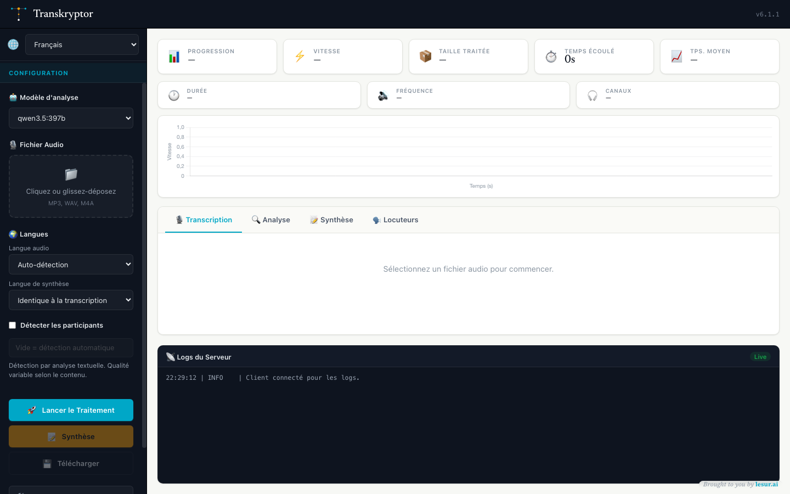

# Transkryptor v4.0.14



## Table des matières
- [Transkryptor v4.0.14](#transkryptor-v4014)
  - [Table des matières](#table-des-matières)
  - [Introduction](#introduction)
  - [Fonctionnalités Clés](#fonctionnalités-clés)
  - [Architecture](#architecture)
  - [Installation](#installation)
  - [Configuration](#configuration)
  - [Utilisation](#utilisation)
  - [Structure des Fichiers](#structure-des-fichiers)
  - [Feuille de route](#feuille-de-route)
  - [Licence](#licence)

## Introduction

Transkryptor v4 est une refonte complète de l'application, la transformant en une plateforme moderne, sécurisée et multi-fournisseurs pour la transcription, l'analyse et la synthèse de contenu audio. L'objectif principal de cette version est d'offrir une flexibilité maximale à l'utilisateur tout en garantissant une expérience utilisateur intuitive et réactive.

Cette application sert de **démonstrateur technologique** pour l'offre **LLMaaS de Cloud Temple**, illustrant la facilité d'intégration et la puissance d'une plateforme souveraine et qualifiée **SecNumCloud**.

## Fonctionnalités Clés

- **Multi-Fournisseurs** : Choisissez entre l'écosystème **Cloud Temple SecNumCloud** (transcription et analyse) ou la combinaison OpenAI (transcription) + Anthropic (analyse).
- **Interface Moderne et Réactive** : Une interface utilisateur entièrement repensée, épurée, et "responsive", offrant une expérience claire et intuitive.
- **Backend Sécurisé (API Gateway)** : Toutes les clés API et les appels externes sont gérés par un serveur backend Node.js. Aucune clé n'est exposée côté client, garantissant une sécurité maximale.
- **Suivi en Temps Réel Détaillé** :
    - Visualisez la progression du traitement avec une grille de statut pour chaque morceau de fichier.
    - Suivez des statistiques avancées (vitesse, temps écoulé, etc.).
    - Observez les logs du serveur en direct pour une transparence totale du processus.
- **Traitement Parallèle Robuste** :
    - **Transcription** : Les fichiers audio sont découpés, transcrits en parallèle et réassemblés. Le traitement a été renforcé pour gérer différents formats audio (stéréo/mono) et éviter les erreurs.
    - **Analyse** : Le texte transcrit est découpé en lots sémantiques et analysé en parallèle.
    - **Gestion des Erreurs** : Un système de tentatives multiples avec délai exponentiel assure la robustesse du traitement.
- **Synthèse Exécutive** : Générez une synthèse structurée (résumé, points clés, actions) à partir de l'analyse en un clic, avec la possibilité de changer de modèle pour affiner le résultat.
- **Améliorations de l'Expérience Utilisateur** :
    - **Persistance des Clés** : Les clés API pour OpenAI et Anthropic sont sauvegardées localement dans votre navigateur.
    - **Validation des Clés** : Les clés sont testées avant de lancer un traitement pour éviter les erreurs coûteuses.
    - **Affichage Progressif** : Les résultats apparaissent au fur et à mesure de leur traitement.

## Architecture

La v4 adopte une architecture client-serveur moderne et sécurisée :
- **Frontend** : Une application monopage (SPA) en **JavaScript "vanilla" (pur) et modulaire**. Elle gère l'interface utilisateur et communique uniquement avec son propre backend. L'état de l'application est géré de manière centralisée, assurant une cohérence des données.
- **Backend** : Un serveur **Node.js/Express** qui implémente le design pattern **API Gateway**. Il reçoit les requêtes du frontend, les authentifie, les enrichit avec les clés API stockées de manière sécurisée dans les variables d'environnement, et les relaie vers les fournisseurs externes appropriés (Cloud Temple, OpenAI, Anthropic).

## Installation

1.  **Prérequis** : Assurez-vous d'avoir [Node.js](https://nodejs.org/) (version 18.x ou supérieure) installé.

2.  **Cloner le dépôt** :
    ```bash
    git clone https://github.com/chrlesur/transkryptor.git
    cd transkryptor
    ```

3.  **Installer les dépendances** :
    ```bash
    npm install
    ```

4.  **Lancer l'application** :
    ```bash
    npm start
    ```

5.  Ouvrez votre navigateur et accédez à `http://localhost:3000`.

## Configuration

1.  **Créer un fichier `.env`** à la racine du projet en copiant le modèle `.env.example`.
2.  **Renseigner la clé API** dans ce fichier `.env`. Cette clé est utilisée par le serveur et n'est jamais exposée au client.
    -   `CLOUD_TEMPLE_API_KEY` : Votre clé pour l'API Cloud Temple.
    -   `CLOUD_TEMPLE_ALLOWED_MODELS` : Liste exacte, séparée par des virgules, des modèles proposés dans l'interface. L'ordre définit aussi le modèle sélectionné par défaut.

## Utilisation

1.  **Choisissez le modèle Cloud Temple SecNumCloud** proposé par le serveur.
2.  **Configurez** :
    -   Pour Cloud Temple, sélectionnez le modèle d'analyse souhaité dans la liste dynamique.
3.  **Sélectionnez un fichier audio** (.mp3, .wav, .m4a).
4.  **Cliquez sur "Lancer le Traitement"**.
5.  **Suivez la progression** en temps réel.
6.  Une fois l'analyse terminée, le bouton **"Lancer la Synthèse"** devient actif.
7.  **Téléchargez** vos résultats à tout moment.
8.  Cliquez sur le bouton **"À propos"** pour comprendre le fonctionnement détaillé du démonstrateur.

## Structure des Fichiers

Le projet est organisé dans un dossier `src/` avec une séparation claire entre le client et le serveur.

```
transkryptor/
├── src/
│   ├── client/
│   │   ├── css/
│   │   ├── js/
│   │   │   ├── ui/         # Modules de gestion de l'interface
│   │   │   ├── analysisProcessor.js
│   │   │   ├── apiService.js
│   │   │   ├── audioProcessor.js
│   │   │   ├── main.js     # Point d'entrée principal
│   │   │   └── ...
│   │   └── index.html
│   └── server/
│       ├── logger.js
│       └── server.js       # Serveur Express
├── .env
├── package.json
└── readme.md
```

## Feuille de route

-   Ajout de nouveaux fournisseurs de services.
-   Mise en place d'un système d'authentification utilisateur pour gérer les projets.
-   Support de plus de formats audio/vidéo.

## Licence

GPL 3.0
